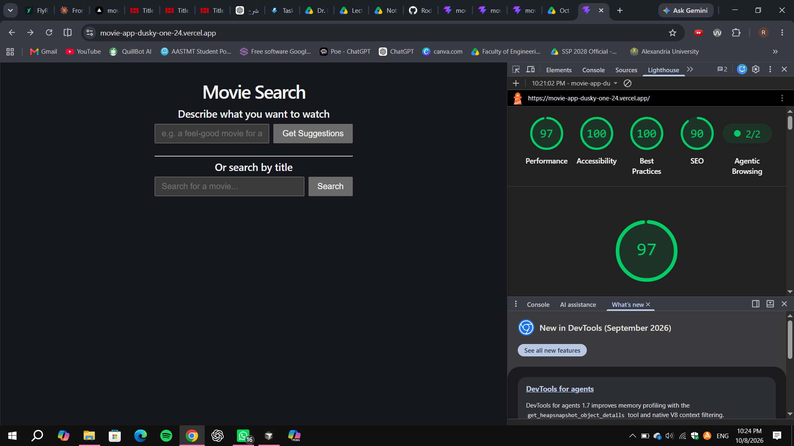
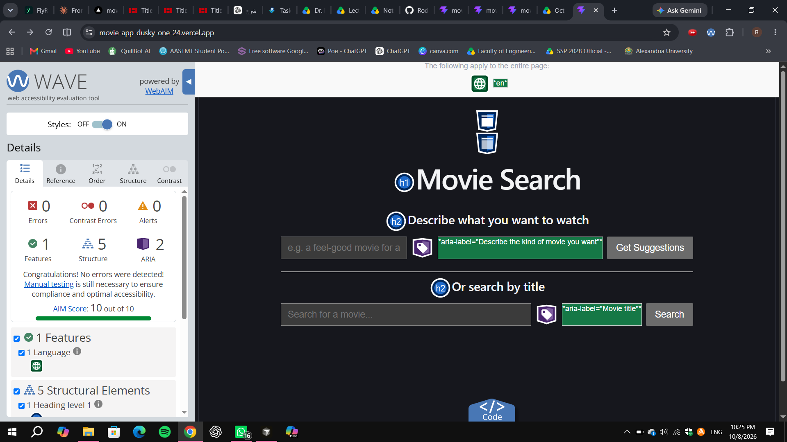
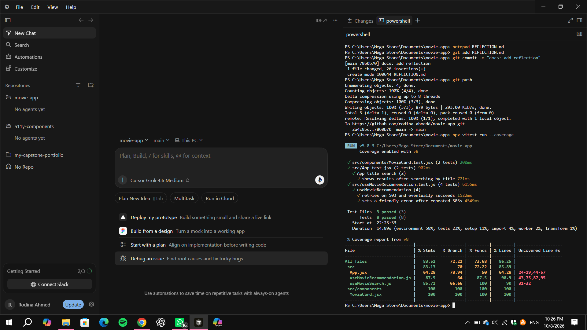

# Movie Search with AI Recommendations

**Live app:** https://movie-app-dusky-one-24.vercel.app/

## Project Brief

Picking a movie is hard when you can't remember a title. You only know
the feeling you want ("something cozy for a rainy day"). Keyword search
can't handle that. This app lets you describe what you want in plain
words, asks an LLM for suggestions, and then verifies each suggestion
against a real movie database before showing it. It's for anyone who
knows the mood but not the title. I chose it because it's a small,
real problem where AI does the part search can't, and I could finish
it properly.

## Run it locally

```
git clone https://github.com/rodina-ahmedd/movie-app.git
cd movie-app
npm install
npm run dev
```

Create a `.env` file in the project root:

```
VITE_OMDB_API_KEY=your_omdb_key
VITE_GEMINI_API_KEY=your_gemini_key
```

Free keys: [OMDb](https://www.omdbapi.com/apikey.aspx) (remember to
click the activation link in the email) and
[Gemini](https://aistudio.google.com).

Run tests: `npm run test`

## Architecture

- `src/App.jsx`: page layout and the two forms (AI description, title search)
- `src/useMovieSearch.js`: custom hook for title search against OMDb
  (loading, error and empty states)
- `src/useMovieRecommendation.js`: custom hook for the AI flow (see below)
- `src/components/MovieCard.jsx`: displays one movie, handles missing posters

## How the AI is used

1. The user's description is sent to the Gemini API with a prompt asking
   for exactly 5 real movie titles as a JSON array, nothing else.
2. The response is parsed. If it isn't valid JSON, the user gets a
   clear message instead of a crash.
3. Each title is looked up on OMDb. Titles that OMDb can't find are
   dropped.

**Why this design:** LLMs can invent movies. Using the model only for
suggestions, and OMDb as the source of truth for what's shown, means
the app never displays a movie that doesn't exist.

**Resilience:** if Gemini returns 503 (high demand), the request is
retried up to 3 times with increasing delays before showing a friendly
error.

## Testing

Vitest + Testing Library, 8 tests across 3 files, all passing.
Run `npx vitest run --coverage` to reproduce the numbers.

| File | Statements |
|------|-----------|
| `MovieCard.jsx` | 100% |
| `useMovieRecommendation.js` | 87.5% |
| `useMovieSearch.js` | 85.7% |
| `App.jsx` | 64.3% |
| **All files** | **83.5%** |

What is covered:
- AI hook: successful flow, invalid JSON from the AI, retry then success
  after a 503, friendly error after repeated 503s
- `MovieCard`: title/year/poster with alt text, fallback when poster is N/A
- `App` (critical user flow): search by title shows results, and a
  readable error appears when OMDb finds nothing

## Performance and accessibility audit

- Lighthouse (mobile): Performance 98, Accessibility 98
- WAVE: 0 errors
- **Improvement from the audit:** WAVE first reported 11 alerts, all
  "No page regions". I wrapped the page in `<main>` and the title in
  `<header>`. After redeploying, WAVE reports 0 alerts.

## Known limitations

- **API keys are visible in the browser.** Vite exposes `VITE_` variables
  to client code, so anyone can find them in DevTools. For production,
  the API calls should move to a server route that holds the keys.
- **Gemini free tier is rate-limited** (about 5 requests per window for
  the model I used), so heavy use hits a quota error.
- Model names change. A model I started with (`gemini-2.0-flash`) was
  retired and returned 404, so the model name lives in one constant.
- The AI form in `App.jsx` is not covered by a test (that is most of the
  uncovered 36% of that file), and there is no end-to-end browser test.

## Future improvements

- Move API calls behind a small serverless function
- Watchlist saved in localStorage
- A test for the AI form flow and an end-to-end browser test

## Deployment checklist

- [x] App builds and runs locally with one install + one dev command
- [x] Environment variables set in Vercel (Production and Preview)
- [x] No secrets committed (`.env` is in `.gitignore`)
- [x] Live URL loads and both features work
- [x] Tests pass
- [x] Lighthouse mobile 90+ (98 / 98)
- [x] WAVE: 0 errors, 0 alerts
- [x] Errors fail safely: invalid AI output, 503, quota, and no-results
      each show a readable message

## How it fails safely

Every failure path ends in a message the user can read: AI busy, AI
returned something unreadable, no results found, or lookup failed. The
app never shows a blank screen or a raw error.

## Rollback

Vercel keeps every previous deployment. To roll back, open the project
in Vercel, go to Deployments, pick the last good one, and choose
"Instant Rollback". Pushing to `main` redeploys automatically.

## Evidence

**Lighthouse (mobile): Performance 98, Accessibility 98**



**WAVE: 0 errors, 0 alerts**



**Test coverage: 8 tests passing, 83.5% overall**



## Reflection

See [REFLECTION.md](REFLECTION.md).